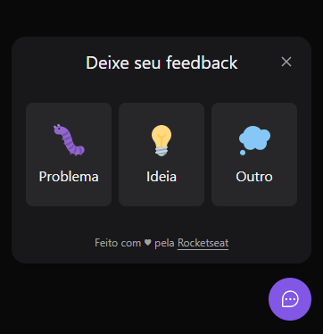

<p align="center">
 
</p>

## 💻 Projeto
Neste projeto criamos um Widget de Feedback para ser adicionado e utilizado em qualquer site. Será um icone que ficará no canto direito inferior do site, no qual, o usuário poderá está realizando o feedback de problemas, ideias e outros assuntos referente ao site que está utilizando, através de texto e print da tela (opcional). A aplicação possui versão web e mobile.

## ✨ Tecnologias

-   [ ] ReactJS
-   [ ] Node
-   [ ] Tailwindcss
-   [ ] Express
-   [ ] Typescript
-   [ ] Prisma
-   [ ] Jest
-   [ ] Cors
-   [ ] Phosphor
-   [ ] React Native
-   [ ] Expo
-   [ ] Expo Google Fonts
-   [ ] React Native SVG
-   [ ] BottomSheet
-   [ ] React Native View Shot
-   [ ] Vite
-   [ ] Vercel
-   [ ] Railway


## :hammer_and_wrench: Features 

-   [ ] O usuário poderá está selencionando o tipo de feedback que deseja passar
-   [ ] O usuário poderá está tirando um print da tela para mostrar o erro da página
-   [ ] O banco estará recebendo o tipo do feedback, o comentário e o print que o usuário enviar
-   [ ] O site poderá está recebendo o email contendo o feedback

## 🔖 Layout

Você pode visualizar o layout do projeto através [desse link](https://www.figma.com/file/T7r5Hwc6aWokmZ5AzLvt5s/Feedback-Widget-(Community)?node-id=100%3A3925). É necessário ter conta no [Figma](http://figma.com/) para acessá-lo.


## Executando o projeto

Utilize o **npm install** para instalar as dependências do projeto.
Em seguida, inicie o projeto.

### Mobile
```cl
expo start
```
### Web
```cl
npm run dev
```

## Hospedagem
A aplicação funcionando encontrasse disponível [aqui](https://nlw-return-impulse-lmdsyzw5b-marcos-fernando.vercel.app)
